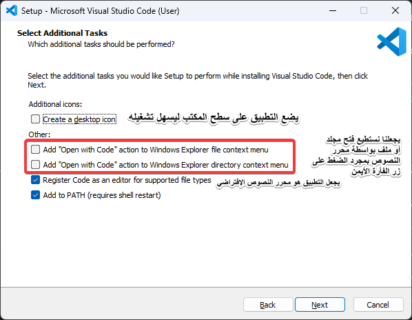
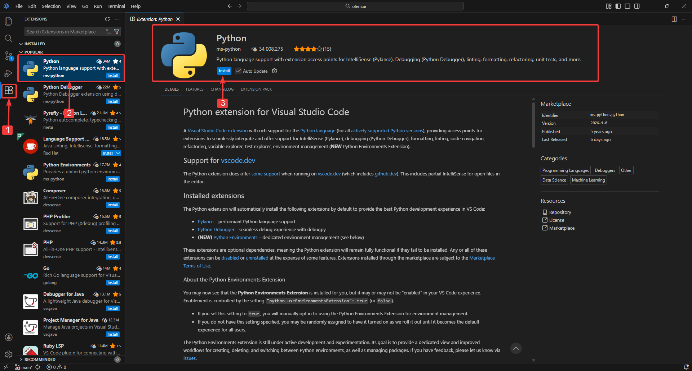
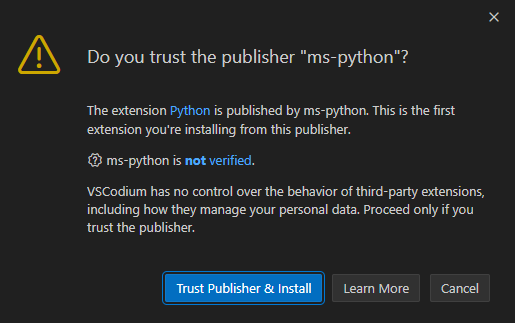

---

title: "تهيئة البيئة البرمجية"
sidebar_position: 2

---

## تثبيت محرر النصوص

### ما هو محرر النصوص؟

بعد أن قمنا بتثبيت لغة بايثون, جاء الآن الدور لتثبيت محرر نصوص, وهو التطبيق الذي نكتب فيه الأوامر البرمجية بشكل سهل ويمكننا تشغيل الملفات منه بكل سهولة.

توجد عدة محررات نصوص لكن أشهرها والذي سنستعمله في دروسنا هو محرر ( Visual Studio Code ) لأنه سهل ويحتوي على إضافات عديدة تسهل عملية البرمجة ويتحدث باستمرار.

### تثبيت محرر النصوص ( Visual Studio Code )

#### نظام تشغيل ويندوز

نتجه أولًا إلى موقع [code.visualstudio.com](https://code.visualstudio.com) 

ثم نضغط على زر ( Download for Windows ) ليبدأ التحميل لدينا

نفتح الملف الذي حملناه ونكتفي بالضغط على ( Next ) حتى يبدأ التحميل, ويمكن قبلها تعديل بعض الخيارات مثل:



### 

#### نظام تشغيل لينكس

Ubuntu: قم بتحميل الملف من [الرابط](https://go.microsoft.com/fwlink/?LinkID=760868) ثم اكتب الأمر التالي 

```bash
sudo apt install <اسم الملف>.deb
```

## تهيئة محرر النصوص

قبل البدء بكتابة أول أمر برمجي يمكننا تهيئة محرر النصوص لاستخدامه مع لغة بايثون. من الشريط الأيسر, نختار خيار الإضافات ( Extensions ) ثم نحمل الإضافة الخاصة بلغة بايثون كما هو موضح في الصورة.



**تنبيه:** إذا ظهر لك هذا التحذير قم بالضغط على ( Trust Publisher & Install )

