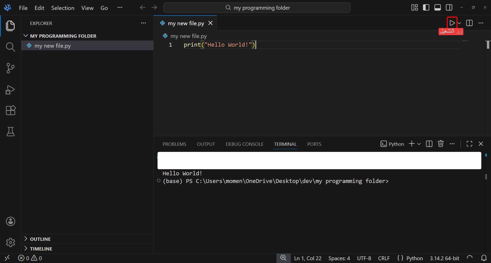

---

title: "كتابة أول سطر برمجي"
sidebar_position: 3

---

## التعرف على بيئة العمل

أول معلومة علينا معرفتها قبل الشروع بالبرمجة هو أين نكتب الأوامر البرمجية؟ وكيف؟

الأوامر البرمجية في لغة بايثون نكتبها في ملف مخزون على الحاسوب الخاص بنا ينتهي اسمه بصيغة ( .py ).

نقوم بكتابة السطور والأوامر داخل هذا الملف في محرر النصوص.

* من قائمة ( File ) في الشريط العلوي للتطبيق نختار خيار ( Open Folder ).

* نصنع مجلد جديد في الحاسوب الخاص بنا في أي مكان نريد.

* نضغط على ( Select Folder ).

سيظهر لنا المجلد الذي قمنا بفتحه كما في الصورة التالية:


الشريط الأيسر باللون الأحمر يمكنا من خلاله التبديل بين ( متصفح الملفات - أداة البحث - الإضافات - الإعدادات ) وغير ذلك.

والمنطقة المشار إليها بالأزرق هو متصفح الملفات, يمكنك من خلاله إنشاء ملف جديد لكتابة الأوامر فيه أو إنشاء مجلد داخل المجلد الحالي.

المنطقة الحمراء على اليمين هي منطقة العمل, وهي التي نرى فيها محتويات الملف المفتوح حاليًا


## إنشاء الملف الأول

لإنشاء أول ملف لنا في محرر ( Visual Studio Code ) نقوم بالضغط على زر إنشاء ملف جديد الموجود في متصفح الملفات.

سيظهر لنا صورة ملف جديد تحت اسم المجلد الحالي, نقوم بكتابة الاسم الذي نريد أن يكون اسم الملف ( يمكننا اختيار ما نشاء على أن يكون منتهيًا بـ .py ) ثم نضغط زر ( Enter ) على لوحة المفاتيح.

## نظرة في داخل الملف الأول

بعد إنشاء الملف الأول, سيفتح مباشرةً وسنرى أنه فارغ من المعلومات والأوامر, جرب كتابة الأمر التالي:

```python
print("Hello World!")
```

ثم قم بحفظ الملف بالضغط على ( Ctrl + S )

ثم شغّل الملف بالضغط على زر التشغيل الموجود في أعلى منطقة العمل, إن كانت خطواتك صحيحة فستظهر لك نافذة صغيرة في الأسفل فيها نتيجة الأمر الذي كتبته ( Hello World! ) كما موضح في الصورة:



## نشاط

حاول تغيير الجملة من ( Hello World! ) إلى جملة أخرى ثم اضغط زر الحفظ ( Ctrl + S ) وشغّل الملف وشاهد النتيجة!

ملاحظة: عليك أن تبقي علامات الإقتباس ( "" ) لأنها هي التي تميز بين النصوص والأرقام


أي: يمكن لنا كتابة (" Hello ") ولكن لا يمكن كتابة ( Hello )


أما الأرقام فنكتبها بدون علامات اقتباس ( 1 ) أو ( 2 ) أو ( 100 ) أيًا كانت


وهذا ليعلم الحاسوب أننا نتعامل مع نصوص مكتوبة. تجدون تفاصيل أكثر في الدرس القادم ( أنواع البيانات ).