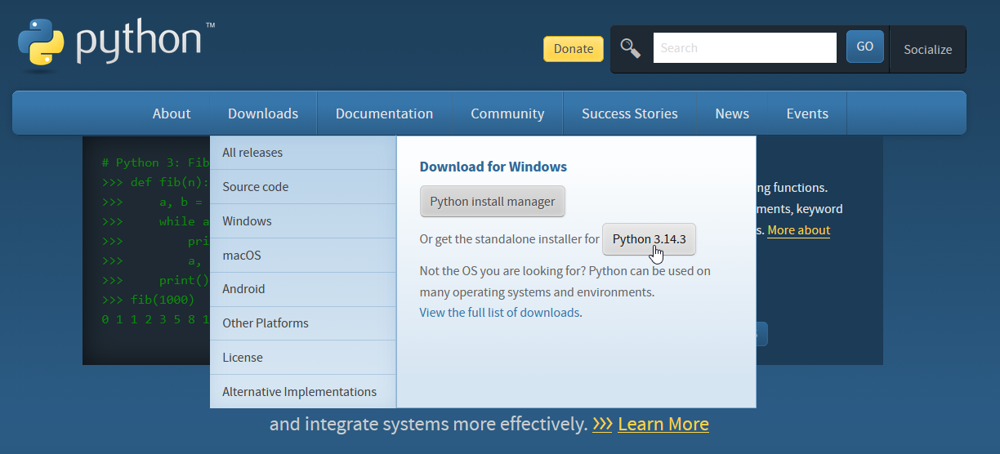
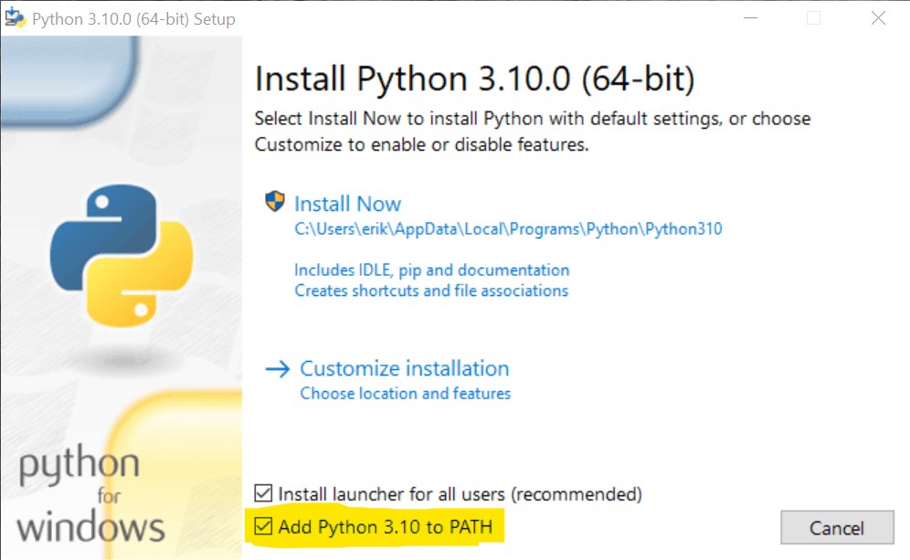

---

title: "المقدمة"
sidebar_position: 1

---

## التعريف بلغة بايثون

لغة بايثون هي لغة برمجة مترجمة عالية المستوى حديثة نسبيًا ( أول إصدار لها يعود للعام 1991 ) متعددة الاستخدامات وتحتوي على مكتبة واسعة جدًا من الإضافات التي تسمح للمبرمج بإضافة قدرات وميزات إضافية والبرمجة في نطاقات واسعة بالإضافة إلى توفرها على منصات الحاسوب الأساسية ( ويندوز - ماك - لينكس ) ويمكن استخدامها أيضًا لبرمجة المتحكمات الإلكترونية الدقيقة وتطبيقات الهاتف المحمول بواسطة بعض الإضافات.

تمتاز لغة بايثون أيضًا بالسهولة التامة فيمكن للجميع تعلمها والبرمجة بها فورًا فلا تحتوي على أي رموز معقدة أو تدخل مباشر في قطع الحاسوب وإنما كل شيء تقوم به اللغة في الخلفية وما عليك إلا أن تعطيها الأمر الذي تريد.

## طريقة تثبيت لغة بايثون على الحاسوب الشخصي

### تثبيتها على نظام ويندوز

لتثبيت اللغة على ويندوز ليمكنك تشغيلها والكتابة بها, توجه إلى موقع [python.org](https://python.org) ثم اذهب إلى قسم التحميل ( Downloads ) ثم حمل المثبِّت ( Standalone installer )



قم بعد ذلك بتشغيل الملف الذي قمت بتحميله واحرص على اختيار ( Add Python to PATH ) وهذا الخيار يسمح لك باستخدام بايثون من أي مكان على جهازك فلا داعي لفتح الملف الذي حملت فيه بايثون كل مرة.



اضغط بعدها على ( Install Now ) ثم انتظر ليكتمل التثبيت, وهكذا تكون لغة بايثون محملة على جهازك بشكل كامل وصحيح.

### تثبيتها على نظام لينكس

تثبيت بايثون على لينكس قد تختلف طريقته باختلاف نظام التشغيل, وقد تكون موجودة بالفعل على نظام التشغيل الذي تستعمله, وهذه طريقة التثبيت على أبرز أنظمة التشغيل:

Debian/Ubuntu/Pop! OS/Linux Mint: 

```bash
sudo apt update && sudo apt install python3
```


Arch Linux:

```bash
sudo pacman -Sy python3
```


 Fedora/RHEL:

```bash
sudo dnf install python3
```